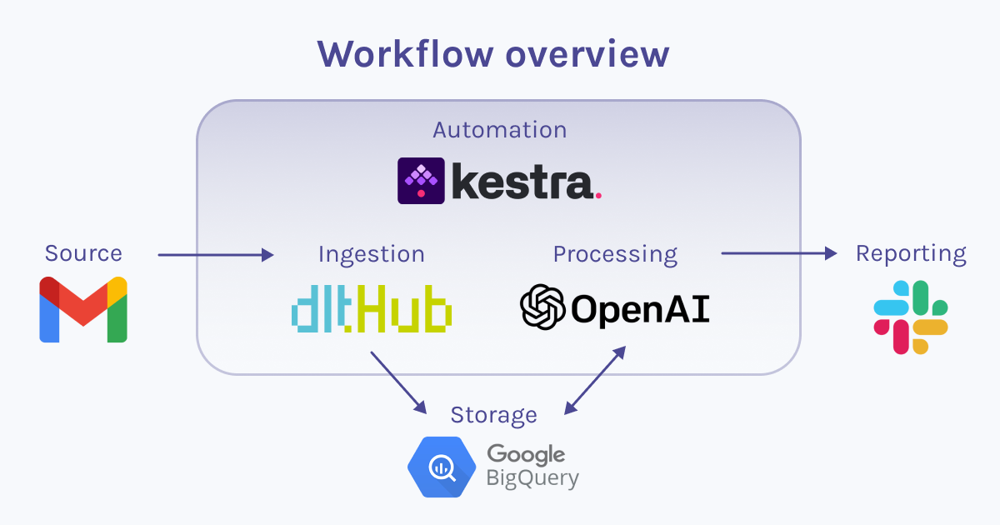

# From Inbox to Insights: AI-enhanced email analysis with dlt and Kestra

## Overview

This is a demo project that shows the automation of a workflow in Kestra. It demonstrates the process of loading data from Gmail into BigQuery using `dlt` (Data Loading Tool) and includes AI analysis, specifically for summarization and sentiment asessment.



The diagram above represents the workflow overview of the automation process in Kestra, encompassing the following steps:

1. Data ingestion from Gmail to BigQuery utilizing `dlt`.
2. Data analysis for summarization and sentiment assessment using OpenAI, with the results stored in BigQuery.
3. Sharing of the outcomes to Slack.

## Prerequisites

1. Gmail credentials
    - IMAP server hostname (default for Gmail is `imap.gmail.com`)
    - Gmail account email
    - App password

    :::note
    For the app pasword, refer to Gmail's [official guidelines](https://support.google.com/mail/answer/185833?hl=en#:~:text=An%20app%20password%20is%20a,2%2DStep%20Verification%20turned%20on).
    :::
2. BigQuery credentials
    - Project ID
    - Private key
    - Client email
    
    :::note
    Learn more about obtaining BigQuery credentials in `dlt`'s [documentation](https://dlthub.com/docs/dlt-ecosystem/destinations/bigquery).
    :::

3. OpenAI API key
    
    :::note
    If you're new to [OpenAi](https://platform.openai.com/), they offer $5 in free credits usable during your first 3 months.
    :::

4. Slack credentials
    - Webhook URL

    :::note
    Follow Slack's [guidelines](https://api.slack.com/messaging/webhooks) to obtain your webhook URL.
    :::

## Setup Guide

1. **Create a Virtual Environment**: It's advised to create a virtual environment to maintain a clean workspace and prevent dependency conflicts, although this is not mandatory.

2. **Create an .env File**: Within your repository, generate an ``.env`` file to securely store credentials in base64 format. Prefix each secret with 'SECRET_' in order for Kestra's [`secret()`](https://kestra.io/docs/developer-guide/variables/function/secret) function to work. The file should look like this: 

    ```env
    SECRET_GMAIL_HOST=someSecretValueInBase64
    SECRET_GMAIL_EMAIL_ACCOUNT=someSecretValueInBase64
    SECRET_GMAIL_PASSWORD=someSecretValueInBase64
    SECRET_BIGQUERY_PROJECT_ID=someSecretValueInBase64
    SECRET_BIGQUERY_PRIVATE_KEY=someSecretValueInBase64
    SECRET_BIGQUERY_CLIENT_EMAIL=someSecretValueInBase64
    SECRET_OPENAI_API=someSecretValueInBase64
    SECRET_SLACK_WEBHOOK_URL=someSecretValueInBase64

    ```

   :::note
   The base64 format is required because Kestra mandates it.
   :::

    Find out more about managing secrets in Kestra [here](https://kestra.io/docs/developer-guide/secrets).

3. **Download Docker Desktop**: As recommended by Kestra, download and install Docker Desktop.

4. **Download Docker Compose File**: Verify that Docker is active and download the Docker Compose file using the following command:
   ```bash
    curl -o docker-compose.yml \
    https://raw.githubusercontent.com/kestra-io/kestra/develop/docker-compose.yml
    ```
5. **Configure Docker Compose File**: Modify your Docker Compose file to include the ``.env`` file:

    ```yaml
    kestra:
        image: kestra/kestra:develop-full
        env_file:
            - .env
    ``` 

6. **Enable Auto-Restart in Docker Compose**: Add ``restart: always`` to the `postgres` and `kestra` services in your `docker-compose.yml`. This ensures they automatically restart after a system reboot:

    ```yaml
    postgres:
        image: postgres
        restart: always
    ```

    ```yaml
    kestra:
        image: kestra/kestra:latest-full
        restart: always
    ```
7. **Start Kestra Server**: Run the following command:
   ```bash
    docker compose up -d
    ```
8. **Access Kestra UI**: Launch http://localhost:8080/ to open the Kestra UI.

## Create Your Flows
1. **Navigate to Flows**: On the left side menu, click on 'Flows', then click 'Create' in the upper right corner.
2. **Copy and Paste YAML Code**: Copy the YAML code from `mainflow.yml` and paste it into the editor in Kestra.
3. **Save Your Main Flow**: After pasting the code, save your flow.
4. **Save Your Subflow**: Repeat the same process for the `subflow.yml` file.

## Understand Your Flows
In Kestra, each flow consists of three required components:
- **`id`**: Represents the name of the flow.
- **`namespace`**: Can be used to separate development and production environments.
- **`tasks`**: A list of tasks to be executed in the order they are defined. Each task in `tasks` must contain an `id` and a `type` as well.

### The Main Flow Explained 

The `dlt-kestra-demo` flow extracts email data from Gmail and loads it into BigQuery using `dlt`, checks for new emails, and if found, triggers the `process_emails` subflow for further processing and analysis. The `tasks` section includes the following tasks:

1. **`dlt_pipeline`**: Loads Gmail data into BigQuery using `dlt`.

    - **The `beforeCommands` Section**: Outlines initial setup commands executed in a Python 3.11 Docker environment, preparing the environment with necessary dependencies.
    - **`warningOnStdEr`**: Set to `false` to ensure that warnings are not treated as critical errors.
    - **The `env` Block**: Defines environment variables, providing essential credentials.

        :::note
        The variable names for Gmail and BigQuery credentials match the `dlt` pipeline's requirements, allowing automatic detection and use of these credentials.
        :::

    - **The `script` Section**: Contains a Python script where we define our `dlt` pipeline and run it: 

        ```python
        # Run dlt pipeline to load email data from gmail to BigQuery
        pipeline = dlt.pipeline(
            pipeline_name="standard_inbox",
            destination='bigquery',
            dataset_name="messages_data",
            full_refresh=False,
        )

        # Set table name
        table_name = "my_inbox"
        # Get messages resource from the source
        messages = inbox_source(start_date = pendulum.datetime(2023, 11, 15)).messages
        # Configure the messages resource to get bodies of the emails
        messages = messages(include_body=True).with_name(table_name)
        # Load data to "my_inbox" table
        load_info = pipeline.run(messages)    
        ```
        
        Using `load_info`, we then define an output with a load status, upon which the next conditional task depends.

        :::note
        Additional parameters, such as the email folder or a start date, can be passed to the `inbox_source()` function. For more detailed information on these parameters and other aspects of the `dlt` library, refer to `dlt`'s official [documentation](https://dlthub.com/docs/dlt-ecosystem/verified-sources/inbox).
        :::

2. **`check_load_status`**: Employs a conditional check to determine if new emails have been loaded. If no new emails are found, it sends a notification to Slack via Kestra's Slack plugin, indicating the absence of new emails. Conversely, if new emails are present, it performs two subsequent tasks:

    - **`get_new_emails`** Utilizes Kestra's BigQuery plugin to query the most recently loaded email data.
    - **`sequential`**: Invokes sequential tasks of the `process_email` subflow for each new email.
  
The `Triggers` section of the main flow features a schedule trigger, using a cron expression to automatically run the workflow every hour on workdays from 10 am to 6 pm, eliminating the need for manual execution. Learn more about Kestra triggers [here](https://kestra.io/docs/developer-guide/triggers).


### The Subflow Explained 

The `process_emails` subflow uses OpenAI to summarize and analyze the sentiment of an email, loads this processed data into BigQuery, and then notifies about the email details via Slack.

1. **`get_summary` and `get_sentiment`**: Use Kestra's OpenAI plugin to get the summary and sentiment of the email body.

2. **`parallel_tasks`**: Executes two tasks in parallel:

    - **`dlt_load_result`**: Runs a Python script to load the processed data into BigQuery using a `dlt` pipeline.

        ```python
        # Define the email data to load, including ID, summary, sentiment, and date, using outputs from previous tasks
        data = [{
                "email_id": '{{ inputs.data[0]['message_uid']}}',
                "summary": '{{outputs.get_summary.choices[0].message.content}}',
                "sentiment": '{{outputs.get_sentiment.choices[0].message.content}}',
                "date": '{{ inputs.data[0]['date']}}'
        }]

        # Create a dlt pipeline for BigQuery
        pipeline = dlt.pipeline(
            pipeline_name='json_to_bigquery',
            destination='bigquery',
            dataset_name='messages_data',
        )

        # Load the data into the specified BigQuery table 
        load_info = pipeline.run(data, table_name="processed_emails")    
        ```

        :::note
        `dlt` will create a new table in Bigquery if the table doesn't exist yet.
        :::


    - **`send_to_slack`**: Utilizes Kestra's Slack plugin to send a message with details like the subject, sender, summary, sentiment, and date of each processed email.

## Execute your flows
To execute a flow in Kestra after setting up the YAML file, simply click on 'Execute' in the top right corner of the Kestra interface. This action initiates the flow. You can then monitor its progress and review outputs directly through the Kestra UI.

## Contact / Support
For guidance on running custom pipelines with `dlt` or orchestrating flows in Kestra, consider joining their Slack communities:

- [dltHub](https://dlthub-community.slack.com)
- [Kestra](https://kestra-io.slack.com)
